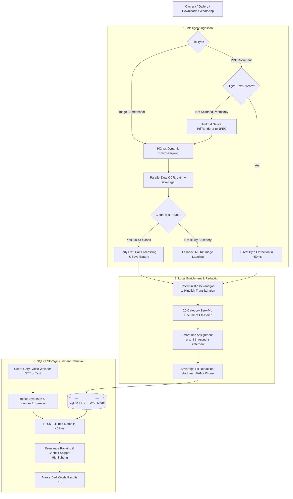

<div align="center">
  

  # Pinpointer
  
  ### A 100% Offline Search Engine & Intelligent Vault for Trapped On-Device Media
  
  <p align="center">
    <a href="https://github.com/ScRocXx/Hackday-1.0/releases/download/app/Pinpointer-v1.1.apk">
      
    </a>
    <a href="https://github.com/ScRocXx/Hackday-1.0/releases/tag/app">
      
    </a>
  </p>

  
  
  
  
  
  
  
  
</div>

---

## 📱 Quick Test: Try the Pre-built Android APK

> [!TIP]
> **Pinpointer is not a UI prototype — it is a production-compiled Android app.**  
> It bundles our native modules, offline quantized Whisper speech models, and custom SQLite FTS5 engine so you can test it directly in Airplane Mode on your phone.

- 📥 **Direct APK Download**: [**`Pinpointer-v1.1.apk`**](https://github.com/ScRocXx/Hackday-1.0/releases/download/app/Pinpointer-v1.1.apk) (~230 MB, fully self-contained)
- 🏷️ **GitHub Release**: [`Tag: app`](https://github.com/ScRocXx/Hackday-1.0/releases/tag/app)
- 📲 **Compatibility**: Runs smoothly on Android 10+ (tested on low-end 3GB–4GB RAM MediaTek & Unisoc devices up to modern flagships).

---

## 📖 The Story: Why We Built Pinpointer

### The Everyday Reality of "Dark Data"
Think about how documents actually move through your life today, especially across India:

A pharmacist WhatsApps you a photo of a doctor's handwritten prescription. You take a quick snapshot of your electricity bill to use as address proof. You download a college marksheet, photograph an auto repair receipt, or save a screenshot of an emergency contact. 

Within weeks, your phone's internal storage looks like this:

```text
📁 Internal Storage / WhatsApp / Downloads
├── 📄 DOC-20240918-WA0012.pdf   <-- Crucial prescription you need right now
├── 🖼️ IMG_20240812_WA0411.jpg   <-- Electricity bill for verification
├── 📄 scan_0048.pdf             <-- Land registry deed
└── 🖼️ IMG_9121.jpg              <-- Aadhaar card scan
```

The text is right there, frozen inside image pixels and flattened PDF streams. But to your phone's operating system, it is completely invisible. It is **"Dark Data"**.

### The Panic Moment
Now picture the moment you actually need one of those documents:
- You are standing at a hospital billing counter, in a clinic basement where mobile signal drops to zero.
- You are at a government office or rural bank branch trying to show your land paper or PAN card.
- You are trying to help an elderly parent locate last month's utility bill.

You open your gallery and scroll through thousands of vacation photos, memes, and downloaded graphics. You search for *"prescription"*, and your phone says **0 results found**.

### The Dilemma
Why hasn't this been solved?
1. **Cloud APIs are a Privacy Minefield**: Uploading your Aadhaar card, PAN card, tax returns, and medical diagnoses to third-party cloud AI servers is a massive privacy risk.
2. **The Cloud Fails When You Need It Most**: When connectivity drops inside basements, subways, or remote towns, cloud solutions vanish.
3. **Naive AI Drains Batteries**: If an app naively spins up heavy deep learning models across 10,000 photos in your gallery, your phone overheats and your battery dies by noon.
4. **The Language Barrier**: Real people don't always search in immaculate English. An Indian user searches for *"bijli bill"*, speaks in Hindi, or types in Hinglish. Most search engines have no idea that *"bijli"* and *"electricity"* are the exact same thing.

We built **Pinpointer** to solve this permanently—with an **Internet-Zero philosophy**.

---

## 💡 How Pinpointer Works: An Engineering Journey

Instead of treating your device as a dumb terminal that relies on cloud servers, Pinpointer turns your phone into an autonomous intelligence vault. 

Here is what happens when documents and queries flow through the app:



### 1. The Battery-Aware Vision Pipeline
When you sync or scan an image, Pinpointer doesn't blindly throw power-hungry neural networks at it:
- **Smart Downsampling**: It resizes high-resolution camera photos down to an optimized 1024×1024 frame. This reduces OCR latency from seconds to **~180ms** while preserving crisp character legibility.
- **Parallel Bilingual OCR**: It runs Google ML Kit Latin and Devanagari models simultaneously.
- **The Early-Exit Breakthrough**: The instant clean text is identified, **the pipeline halts immediately**. It skips heavy multi-label object recognition on over 90% of documents. Your phone stays cool, GPU/NPU wakeups are prevented, and battery life is preserved.
- **Noise Filtering**: OCR garbage from blurry photos or textures is caught by an alphanumeric ratio heuristic (<30% clean text is automatically rejected).

### 2. The 5-Phase PDF Engine
PDFs are notorious for being inconsistent. Some are digitally generated; others are camera photos wrapped in a PDF envelope. Pinpointer treats them with a dedicated 5-phase pipeline:
- **Native Byte Parsing**: For digital PDFs (bank statements, flight tickets, invoices), Pinpointer parses the raw internal PDF text operators (`BT`...`ET`, `Tj`/`TJ`) directly in **~50ms per page** without ever rasterizing an image or invoking AI.
- **Native Hardware Rasterization**: If a PDF is a scanned photocopy, Android's native `android.graphics.pdf.PdfRenderer` converts pages 1–3 into JPEGs and hands them to the vision pipeline.

### 3. Turning Messy Files into Human Knowledge
No user remembers what `DOC-20240918-WA0012.pdf` was. Pinpointer runs a pure-JavaScript rule-based classifier in **<1ms**:
- It recognizes **20 distinct Indian document categories** (Aadhaar cards, PAN cards, voter IDs, driving licenses, bank statements, salary slips, tax returns/Form 16, invoices, receipts, marksheets, electricity bills, medical reports, and more).
- It extracts a **Smart Title**: that mysterious WhatsApp file is filed in your Document Vault as *"BSES Rajdhani Electricity Bill"* or *"HDFC Bank Statement"*.

### 4. Speaking the User's Language
India is inherently multilingual:
- **Deterministic Transliteration**: Devanagari characters are mapped into Romanized Hinglish phonetically (e.g., `"आधार"` → `"aadhaar"`, `"कमल"` → `"kamal"`).
- **Concept Pairing**: The query engine understands Indian synonyms. If you type *"bijli"*, it knows to look for *"electric bill"*, *"power bill"*, and *"electricity"*. If you search *"salary"*, it pulls up *"payslip"* and *"CTC"*.
- **Zero-LLM Overhead**: Everything is deterministic rule-based mapping—meaning zero hallucination, zero token cost, and instantaneous speed.

### 5. Hands-Free On-Device Voice Intelligence
Touch typing on mobile can be frustrating. Pinpointer embeds a quantized INT8 Whisper Base speech-to-text model running via `sherpa-onnx` and native JNI bindings. 
- You tap the microphone and say: *"Pichla bijli bill dikhao"* or *"Find my car insurance"*.
- Your voice is captured as 16kHz PCM audio and transcribed locally on your processor in **~1.1 seconds** with zero Wi-Fi or cellular connection.

### 6. Sovereign PII Masking (DPDP Act 2023)
Before any text is written to the local database, it passes through an immutable redaction filter:
- **Aadhaar**: `1234 5678 9012` → `****-****-9012`
- **PAN**: `ABCDE1234F` → `ABCDE****F`
- **Phone**: `9876543210` → `******3210`
Sensitive national IDs are never stored in plain text, ensuring strict compliance with India's Digital Personal Data Protection Act.

### 7. Instant Hybrid Search in Under 12ms
All enriched tokens, Soundex phonetic codes, and smart titles live in a local SQLite database configured with Write-Ahead Logging (WAL) and FTS5 (Full-Text Search). Even across a massive library of 50,000 documents, your queries return in **<12ms**, highlighting the exact snippet of text where the match occurred.

---

## 🌍 Where This Matters in the Real World

```text
🏥 In Hospital Basements & Emergency Rooms
   A family member needs a past cardiology prescription or blood group report. Cellular data 
   is blocked by concrete walls. Pinpointer searches and opens the prescription instantly.

🌾 In Rural Banking, Field Work & Micro-Lending
   A loan officer is verifying KYC documents, land records, or ration cards in a remote village 
   with zero tower connectivity. Everything stays local, fast, and accessible.

👴 For Parents & Elderly Users
   Instead of struggling to navigate nested Android file managers and cryptic folder trees, 
   they simply tap the microphone: "Pichla bijli bill dikhao."

⚖️ For Privacy-Sensitive Professionals
   Lawyers, doctors, chartered accountants, and journalists keep privileged client documents 
   on their personal phones with 100% certainty that no third-party cloud server has a copy.
```

---

## 📊 How Pinpointer Compares

| Dimension | Cloud AI (Vision APIs) | DigiLocker | Apple Intelligence | **Pinpointer** |
|---|:---:|:---:|:---:|:---:|
| **Works 100% Offline** | ❌ Never | ❌ Requires Active Internet | ⚠️ Hybrid Cloud Fallback | ✅ **100% On-Device** |
| **Where Data is Processed** | 3rd-Party Remote Cloud | Government Server | On-Device + Cloud | ✅ **Exclusively on Phone** |
| **Low-End Hardware (3–4GB RAM)** | ⚠️ Heavy client app | ⚠️ Web-dependent | ❌ Requires Flagship A17+ | ✅ **Built for 3–4GB Android** |
| **Hindi / Hinglish Context** | ⚠️ Generic OCR only | ❌ Exact text only | ⚠️ Limited Indian Context | ✅ **Built-in Transliteration & Synonyms** |
| **Messy WhatsApp Photos & PDFs** | ⚠️ Manual file uploads | ❌ Official issued docs only | ⚠️ Photos only, ignores PDFs | ✅ **Auto-Scans & Auto-Classifies** |
| **Unified Search Bar** | ❌ Fragmented | ❌ PDFs only | ⚠️ Siloed search | ✅ **One Search for Images + PDFs** |
| **Cloud Server Bills** | 📈 ~$1.50 per 1K pages | N/A | High device premium | ✅ **$0.00 / month flat** |

---

## ⏱️ Verified Performance Benchmarks

| Operation | Engine / Component | Measured Speed | Resource Footprint |
|---|---|---|---|
| **Digital PDF Text Extraction** | Byte-Stream Parser (`DocumentPipeline.ts`) | **~50 ms** / page | Minimal CPU, Zero AI |
| **Scanned Document OCR** | Google ML Kit Latin + Devanagari | **~180–280 ms** | 1024px Downsampled Frame |
| **FTS5 Full-Text Query (50K docs)** | SQLite 3 FTS5 with Unicode61 Tokenizer | **< 12 ms** | In-memory B-Tree index |
| **Offline Voice Transcription** | Sherpa-ONNX Whisper Base (INT8) | **~1.1 s** | On-Device CPU/NPU |
| **Document Classification & Title** | Deterministic Keyword Matcher | **< 1 ms** | Zero ML overhead |
| **Active Sync Memory Usage** | Stream-based processing queue | **< 150 MB RAM** | Safe on 3GB–4GB RAM phones |

---

## 💻 Tech Stack & Key Libraries

| Layer | Technology | Purpose in Pinpointer |
|---|---|---|
| **Core Framework** | React Native `0.83.1` (React `19.2.0`, TypeScript `5.9.2`) | Cross-platform UI architecture and reactive state management |
| **Local Database** | `react-native-quick-sqlite` | High-performance C-based SQLite 3 engine with FTS5 and WAL mode |
| **Computer Vision** | `@react-native-ml-kit/text-recognition` | On-device OCR for Latin and Devanagari scripts |
| **Object Recognition** | `@react-native-ml-kit/image-labeling` | Fallback scene labeling for photos with no readable text |
| **Voice Intelligence** | `sherpa-onnx` 1.13.6 AAR (k2-fsa) | Embedded offline Whisper Base INT8 speech recognition via JNI |
| **Native Android** | Kotlin & Java Native Modules | Hardware PDF rasterization (`PdfRenderer`), PCM audio capture, Intent launcher |
| **Image Processing** | `react-native-image-resizer` | Dynamic downsampling to 1024px to accelerate OCR and protect RAM |
| **Media Access** | `@react-native-camera-roll/camera-roll` | Local gallery querying and storage indexing |
| **UI & Styling** | `@react-navigation/stack`, `react-native-linear-gradient`, `react-native-svg` | Aurora dark-mode glassmorphic interface, animated voice orb, and visual cards |

---

## 📂 Project Structure & Architecture

```text
Hackday-1.0/
├── android/                                    # Native Android platform
│   ├── app/
│   │   ├── libs/                               # sherpa-onnx native AAR (v1.13.6)
│   │   └── src/main/
│   │       ├── assets/models/whisper/          # Bundled offline Whisper INT8 models
│   │       └── java/ai/runanywhere/starter/
│   │           ├── MainActivity.kt             # React Native main activity
│   │           ├── MainApplication.kt          # Native package registrations
│   │           ├── NativeAudioModule.kt        # 16-bit 16kHz PCM audio recorder
│   │           ├── NativePdfModule.kt          # Native PdfRenderer rasterizer & metadata bridge
│   │           ├── OCRModule.java              # ML Kit Devanagari text recognition wrapper
│   │           ├── SherpaOnnxModule.kt         # Offline speech recognition via sherpa-onnx JNI
│   │           └── StorageModule.java          # Asset unpacking & Intent-based PDF opener
├── src/
│   ├── assets/                                 # App logos and visual branding
│   ├── components/                             # Reusable UI elements
│   │   ├── AudioVisualizer.tsx                 # Real-time audio waveform bar visualizer
│   │   ├── FeatureCard.tsx                     # Dashboard quick action cards
│   │   ├── ModelDownloadSheet.tsx              # Model lifecycle management modal
│   │   ├── ModelLoaderWidget.tsx               # Status indicator for local models
│   │   ├── SearchFilterChips.tsx               # Filter pills ('All', 'Photos', 'Documents')
│   │   ├── SearchHistoryPanel.tsx              # Search suggestions with delete & clear all
│   │   └── SyncProgressCard.tsx                # Animated syncing progress bar & shield badge
│   ├── hooks/                                  # React custom hooks & context
│   │   ├── PinpointerContext.tsx               # Global search, sync, and application state
│   │   ├── useDocumentSync.ts                  # Background PDF discovery and indexing
│   │   ├── useGallerySync.ts                   # CameraRoll scanner with pause/resume support
│   │   ├── usePinpointer.ts                    # Main controller hook
│   │   ├── useSearch.ts                        # Debounced search and ranking dispatcher
│   │   └── useVoiceRecording.ts                # Sherpa-ONNX microphone listener
│   ├── navigation/                             # App navigation & route parameters
│   │   └── types.ts                            # RootStackParamList definitions
│   ├── screens/                                # Application views
│   │   ├── DocumentVaultScreen.tsx             # 20-category organized document repository
│   │   ├── gallery.tsx                         # Time-filtered recent photos & media viewer
│   │   ├── HomeScreen.tsx                      # Drawer menu & sync trigger dashboard
│   │   ├── PinpointerScreen.tsx                # Main search interface, voice orb & results list
│   │   ├── PointAndSpeakScreen.tsx             # Point-and-shoot camera OCR utility
│   │   ├── SmartClipboardScreen.tsx            # OCR text scanner, clipboard editor & history
│   │   └── SpeechToTextScreen.tsx              # Dedicated offline voice transcription testbed
│   ├── services/                               # Service providers
│   │   └── ModelService.tsx                    # Background model management
│   ├── theme/                                  # Design system tokens
│   │   ├── colors.ts                           # Aurora dark-mode palette & accents
│   │   └── index.ts                            # Theme exports
│   ├── utils/                                  # Core algorithmic pipelines
│   │   ├── AppLogger.ts                        # Structured application logger
│   │   ├── DataMasking.ts                      # DPDP 2023 PII redaction (Aadhaar, PAN, phone)
│   │   ├── DocumentClassifier.ts               # Zero-cost 20-category classifier & smart titles
│   │   ├── DocumentPipeline.ts                 # 5-phase PDF intelligence pipeline
│   │   ├── GallerySync.ts                      # Image batch scanner & thumbnail generator
│   │   ├── HindiTranslit.ts                    # Deterministic Devanagari to Hinglish transliterator
│   │   ├── RecentPhotos.ts                     # Local recent photo cache
│   │   ├── SearchHistory.ts                    # Persistent local search history
│   │   ├── Soundex.ts                          # Typo-tolerant phonetic encoding algorithm
│   │   ├── TextEnrichment.ts                   # Multilingual index builder
│   │   └── VisionPipeline.ts                   # Downsampling, dual OCR, and early-exit logic
│   ├── App.tsx                                 # Root application container & stack navigator
│   └── Database.ts                             # SQLite FTS5 database, triggers & ranking engine
├── download-models.js                          # Build-time script to fetch sherpa-onnx AAR & models
├── package.json                                # Project dependencies and scripts
└── tsconfig.json                               # TypeScript configuration
```

---

## 🗺️ What We're Building Next

- [x] **Phase 1 (Working Today)**: Production-ready Android APK with 100% offline OCR, 5-phase PDF parsing, 20-category auto-classification, FTS5 hybrid search, and offline Whisper voice input.
- [ ] **Phase 2 — On-Device SLM**: Embed a compact, quantized 1.5B model to answer questions across your personal documents offline (*"What was the total amount I paid in electricity bills across all houses this year?"*).
- [ ] **Phase 3 — Offline Mesh Sharing**: Peer-to-peer document sharing over Wi-Fi Direct and BLE for disaster zones, rescue operations, and remote field deployments.
- [ ] **Phase 4 — Semantic Search**: Pair lightweight on-device vector embeddings alongside FTS5 for conceptual search (*"house repair"* matches a masonry contractor invoice).
- [ ] **Phase 5 — Video Frame OCR**: Index presentation slides, whiteboards, and receipts captured inside recorded video clips.

---

## 🛠️ Local Setup & Building from Source

### Prerequisites
- **Node.js**: `v18+`
- **JDK**: Java 17 or Java 11
- **Android SDK**: API 29+ (compiles against SDK 35)
- **Physical Device or Android Emulator** with camera and microphone permissions enabled

### Steps

1. **Clone the repository**:
   ```bash
   git clone https://github.com/ScRocXx/Hackday-1.0.git
   cd Hackday-1.0
   ```

2. **Install dependencies**:
   ```bash
   npm install
   ```
   > *The `postinstall` script automatically applies local patches and runs `download-models.js` to download the native `sherpa-onnx` AAR into `android/app/libs` and the quantized Whisper model into `android/app/src/main/assets/models/`.*

3. **Start the Metro bundler**:
   ```bash
   npm start
   ```

4. **Launch the application on Android**:
   ```bash
   npx react-native run-android
   ```

---
