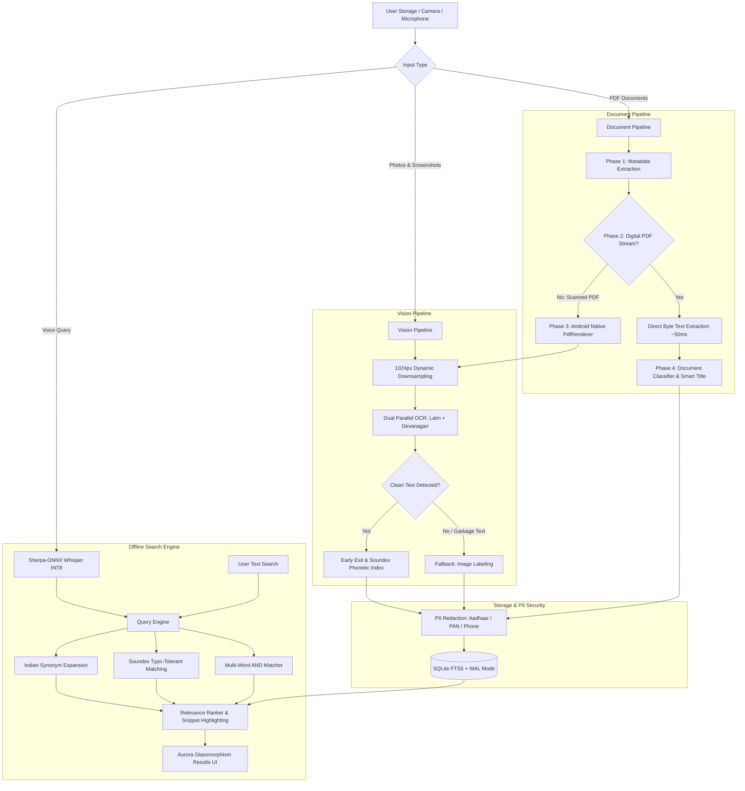

<div align="center">
  

  # PinPointer
  
  ### Search Trapped Text in Screenshots, Photos & PDFs — 100% Offline
  
  <p align="center">
    <a href="https://github.com/ScRocXx/Hackday-1.0/releases/download/app/Pinpointer-v1.1.apk">
      
    </a>
    <a href="https://github.com/ScRocXx/Hackday-1.0/releases/tag/app">
      
    </a>
  </p>

  
  
  
  
  
  
  
  
</div>

---

## ⚡ Try the App (Pre-built Android APK)

> [!TIP]
> **PinPointer is fully functional on real Android hardware — not just a UI mockup.**  
> Test it in Airplane Mode with your own camera photos, downloaded PDFs, and voice queries.

- 📦 **Download Link**: [**`Pinpointer-v1.1.apk`**](https://github.com/ScRocXx/Hackday-1.0/releases/download/app/Pinpointer-v1.1.apk) (~230 MB, includes bundled offline Whisper STT model)
- 🏷️ **Release Tag**: [`app`](https://github.com/ScRocXx/Hackday-1.0/releases/tag/app)
- 📱 **Requirements**: Android 10+ (tested on entry-level MediaTek/Unisoc 3GB–4GB RAM phones up to flagship devices).

---

## 🔴 The Problem: Everyday "Dark Data" in India

A vast amount of critical personal documentation in India lives as unsearchable images and randomly named files:

```text
📁 Internal Storage / WhatsApp / Downloads
├── 📄 DOC-20240918-WA0012.pdf   <-- Actually a doctor's prescription!
├── 🖼️ IMG_20240812_WA0411.jpg   <-- Electricity bill (needed for address proof)
├── 📄 scan_0048.pdf             <-- Land registry agreement
└── 🖼️ IMG_9121.jpg              <-- Aadhaar card scan
```

### Why Existing Solutions Fall Short
1. **Unsearchable Scans & File Names**: WhatsApp names files cryptically (`DOC-2024***-WA0012.pdf`). Finding a past medical report or fee receipt means manually opening dozens of files.
2. **Cloud Isn't Always an Option**:
   - Free cloud storage tiers fill up quickly and halt automatic syncing.
   - Standard gallery apps organize photos by date or face, completely ignoring text inside PDFs and screenshots.
   - In hospitals, basement clinics, rural bank branches, or government offices, internet connectivity often drops to zero.
3. **Severe Privacy Risks**:
   - Uploading Aadhaar cards, PAN cards, bank statements, and health records to third-party cloud AI APIs creates regulatory and personal security risks.
4. **No Native Hindi / Hinglish Search**:
   - Cloud search solutions rarely handle bilingual Indian contexts where a user searches for *"bijli bill"* to find an electricity invoice, or types in Romanized Hindi.

---

## 💡 What PinPointer Does

**PinPointer** is a **100% offline, privacy-first search gallery** that indexes text inside screenshots, photos, camera scans, and PDFs right on your phone.

- ✈️ **100% Offline Search**: Works entirely in Airplane Mode. Queries return in **<15ms**.
- ⚡ **Smart PDF + OCR Pipeline**: Digital PDFs are parsed via direct byte-stream extraction in **~50ms**. OCR is only triggered as a fallback for scanned images.
- 🗣️ **English + Hindi + Hinglish Voice & Text Search**: Search naturally using English, Hindi, or Hinglish. Searching *"bijli"* or *"electricity"* surfaces the same bill.
- 🏷️ **Automatic Document Classification**: Identifies 20+ common Indian document types (Aadhaar, PAN, marksheets, receipts, bills) and assigns meaningful Smart Titles automatically.
- 🛡️ **Sovereign PII Redaction**: Aligns with India's **DPDP Act 2023** by irreversibly masking Aadhaar, PAN, and phone numbers before writing anything to disk.
- 🔋 **Battery-Aware 90% Compute Bypass**: Sequential early-exit pipeline stops processing as soon as clean text is detected, bypassing heavy vision models and preventing GPU/NPU battery drain.

---

## 📊 Feature Comparison Matrix

| Capability | Cloud AI (Vision APIs) | DigiLocker | Apple Intelligence | **PinPointer** |
|---|:---:|:---:|:---:|:---:|
| **Works 100% Offline** | ❌ Never | ❌ Needs Internet | ⚠️ Partial / Cloud Fallback | ✅ **100% On-Device** |
| **Data Processing Location** | Remote 3rd-Party Cloud | Government Cloud | Hybrid Cloud / Device | ✅ **Exclusively on Phone** |
| **Low-End Hardware (3–4GB RAM)** | ⚠️ App only (heavy cloud) | ⚠️ Web-reliant | ❌ Requires Flagship A17+ | ✅ **Optimized for 3–4GB RAM** |
| **Hindi / Hinglish Search** | ⚠️ Service dependent | ❌ Exact text only | ⚠️ Limited Indian Context | ✅ **Built-in Transliteration & Synonyms** |
| **Messy WhatsApp Files & Photos** | ⚠️ Manual upload required | ❌ Government issued only | ⚠️ Photos only | ✅ **Automatic Auto-Classification** |
| **Unified Search (PDFs + Photos)** | ⚠️ Separate tools | ❌ PDFs only | ⚠️ Separate silos | ✅ **Single Instant Search Bar** |
| **Infrastructure Cost at Scale** | 📈 ~$1.50 / 1K pages | N/A | High device cost | ✅ **$0.00 / Month Server Cost** |

---

## 🏢 Real-World, Low-Connectivity Use Cases

```text
🏥 Hospitals & Pharmacies
   Find past prescriptions or lab reports in hospital basements where mobile signal is dead.

🌾 Rural Banking & Micro-Lending
   Field agents can verify KYC documents, land deeds, and ration cards without relying on cellular towers.

👴 Parents & Elderly Users
   Avoid folder navigation entirely; search or use voice: "Pichla bijli bill dikhao."

⚖️ Privacy-Sensitive Professionals
   Lawyers, accountants, and doctors keep confidential files strictly on-device with zero leak vector.
```

---

## 🏗️ System Architecture & Workflow



---

## ⚙️ Technical Deep Dive

### 1. Battery-Aware Vision Pipeline ([`VisionPipeline.ts`](file:///c:/Users/pc/Downloads/Hackday%201.0/src/utils/VisionPipeline.ts))
- **Dynamic Downsampling**: Resizes high-res images to 1024×1024 JPEG before inference; automatically purges temporary cache files after scanning.
- **Parallel Latin + Devanagari OCR**: Uses lightweight on-device ML Kit models concurrently.
- **Noise Rejection**: Heuristically discards OCR noise if clean alphanumeric/Devanagari characters make up <30% of output.
- **90% Compute Bypass**: Halts immediately when clean text is present, avoiding expensive multi-label object classifiers on over 90% of documents.

### 2. 5-Phase PDF Intelligence ([`DocumentPipeline.ts`](file:///c:/Users/pc/Downloads/Hackday%201.0/src/utils/DocumentPipeline.ts))
- **Direct Byte-Stream Extraction**: Parses internal PDF content streams (`BT`...`ET`, `Tj`/`TJ`) for digital PDFs in **~50ms**, bypassing rasterization entirely.
- **Native Android Rasterization**: Uses Android's native `android.graphics.pdf.PdfRenderer` to convert scanned document pages into JPEGs without third-party native bloat.
- **Progressive Scanning**: Prioritizes pages 1–3 in the foreground for instant search feedback.

### 3. Zero-Cost Document Classifier ([`DocumentClassifier.ts`](file:///c:/Users/pc/Downloads/Hackday%201.0/src/utils/DocumentClassifier.ts))
- Classifies files into **20 Indian document categories** (Aadhaar, PAN, Voter ID, Driving License, Passport, Bank Statement, Salary Slip, Tax Return, Invoice, Receipt, Marksheet, Electricity Bill, Medical Report, etc.).
- **Smart Title Generation**: Replaces unhelpful filenames (e.g. `DOC-20240918-WA0012.pdf` → *"SBI Bank Statement"* or *"BSES Electricity Bill"*). Runs in **<1ms** with zero ML overhead.

### 4. Hybrid Offline Search Engine ([`Database.ts`](file:///c:/Users/pc/Downloads/Hackday%201.0/src/Database.ts))
- **SQLite with WAL Mode**: Write-Ahead Logging enables non-blocking concurrent indexing while the user searches.
- **FTS5 Virtual Table**: Full-Text Search with `unicode61` tokenizer and automated database update triggers.
- **Synonym Expansion**: Connects aliases seamlessly (e.g., `aadhaar` ↔ `aadhar` ↔ `uidai`; `pan` ↔ `pancard`; `bijli` ↔ `electricity`).
- **Phonetic Matching**: Soundex encoding provides typo tolerance for voice and text queries.
- **Weighted Relevance Ranking**: Prioritizes title matches (+50 pts), exact phrase matches (+30 pts), and recency.

### 5. On-Device Voice Search ([`SherpaOnnxModule.kt`](file:///c:/Users/pc/Downloads/Hackday%201.0/android/app/src/main/java/ai/runanywhere/starter/SherpaOnnxModule.kt))
- Uses native `sherpa-onnx` JNI runtime with an INT8-quantized Whisper model for offline speech recognition.
- Captures 16kHz mono PCM audio directly into memory with zero internet dependency.

### 6. Sovereign PII Masking ([`DataMasking.ts`](file:///c:/Users/pc/Downloads/Hackday%201.0/src/utils/DataMasking.ts))
- Masks sensitive data before database insertion:
  - Aadhaar: `****-****-9012`
  - PAN: `ABCDE****F`
  - Phone: `******3210`

---

## ⏱️ Measured Latency Benchmarks

| Metric / Operation | Tested Latency | Resource Footprint |
|---|---|---|
| **Digital PDF Text Extraction** | **~50 ms** / page | Minimal CPU |
| **Camera / Scanned Document OCR** | **~180–280 ms** | Downsampled 1024px |
| **Database FTS5 Query (50K records)** | **< 12 ms** | In-memory index |
| **Offline Voice Transcription** | **~1.1 s** | INT8 Quantized Whisper |
| **Document Classification & Smart Title** | **< 1 ms** | Zero-ML rule engine |
| **Memory Consumption (Active Sync)** | **< 150 MB RAM** | Stream-based processing |

---

## 📱 App Screens Overview

- **Pinpointer Main Search** ([`PinpointerScreen.tsx`](file:///c:/Users/pc/Downloads/Hackday%201.0/src/screens/PinpointerScreen.tsx)): Aurora dark-mode interface, voice listening orb, search history with one-tap deletion, filter chips (`All`, `Photos`, `Documents`), and full-screen image preview with sharing & scanning shortcuts.
- **Document Vault** ([`DocumentVaultScreen.tsx`](file:///c:/Users/pc/Downloads/Hackday%201.0/src/screens/DocumentVaultScreen.tsx)): Categorized view of all device PDFs with confidence scores, category badges, and instant opening in native viewers.
- **Scan Images / Smart Clipboard** ([`SmartClipboardScreen.tsx`](file:///c:/Users/pc/Downloads/Hackday%201.0/src/screens/SmartClipboardScreen.tsx)): Camera and gallery OCR scanner with copy-to-clipboard, text editor, and scan history.
- **Point & Speak** ([`PointAndSpeakScreen.tsx`](file:///c:/Users/pc/Downloads/Hackday%201.0/src/screens/PointAndSpeakScreen.tsx)): Point-and-shoot camera OCR with visual scanning radar.
- **Speech to Text** ([`SpeechToTextScreen.tsx`](file:///c:/Users/pc/Downloads/Hackday%201.0/src/screens/SpeechToTextScreen.tsx)): Voice transcription playground with animated audio level bars.
- **Recent Searches & Gallery** ([`gallery.tsx`](file:///c:/Users/pc/Downloads/Hackday%201.0/src/screens/gallery.tsx)): Time-filtered photo grid (*Today*, *Yesterday*, *Last Week*).

---

## 📈 Scalability & Business Model

```text
       Cloud OCR (AWS / Google Vision)
  Cost   ~ $1.50 / 1,000 pages
   ▲                   /
   │                  /  (Cost explodes with users)
   │                 /
   │                /
   │               /
   │  ───────────/────────────────────
   │  PinPointer Edge: $0.00 / month flat
   └──────────────────────────────────────► Scale (Millions of Pages)
```

- **$0 Server Infrastructure Cost**: Indexing and search run entirely on the user's hardware. Scaling from 1,000 to 10,000,000 users costs $0 in cloud OCR bills.
- **B2B SDK Opportunity**: The offline document search and OCR pipeline can be packaged as an SDK for fintech, micro-lending, logistics, and field-agent apps.
- **B2C Freemium**: Core offline search is free; premium features could include encrypted cross-device sync and selective cloud backup.
- **Public & Governance Deployments**: Ideal for e-governance, healthcare camps, and rural public distribution systems.

---

## 🗺️ Roadmap & What We're Building Next

- [x] **Phase 1 (Done — Current Release)**: Working Android APK with offline OCR, PDF stream parsing, FTS5 hybrid search, 20+ document classifiers, and offline Whisper voice search.
- [ ] **Phase 2 — On-Device SLM**: Embed a small quantized 1.5B language model for local cross-document question answering (e.g. *"How much did I pay for electricity this year across all bills?"*).
- [ ] **Phase 3 — Offline Mesh Sharing**: Peer-to-peer document sharing over Wi-Fi Direct and BLE for disaster zones and low-connectivity field operations.
- [ ] **Phase 4 — Semantic Embeddings**: Pair a lightweight vector embedding model alongside FTS5 for conceptual matching (e.g., searching *"house repair"* matches a masonry quote).
- [ ] **Phase 5 — Video OCR**: Index whiteboard slides and receipts captured inside recorded video clips.

---

## 💻 Local Setup & Development

### Prerequisites
- **Node.js**: `v18+`
- **JDK**: Java 17 or Java 11
- **Android SDK**: API 29+ (compiles on SDK 35)

### Steps

1. **Clone the repository**:
   ```bash
   git clone https://github.com/ScRocXx/Hackday-1.0.git
   cd Hackday-1.0
   ```

2. **Install dependencies** (automatically fetches sherpa-onnx AAR and Whisper models via `postinstall`):
   ```bash
   npm install
   ```

3. **Start the Metro bundler**:
   ```bash
   npm start
   ```

4. **Build and run on Android**:
   ```bash
   npx react-native run-android
   ```

---

<div align="center">
  <sub><strong>PinPointer</strong> — Built for privacy, zero cloud bills, and instant offline discovery.</sub>
</div>
