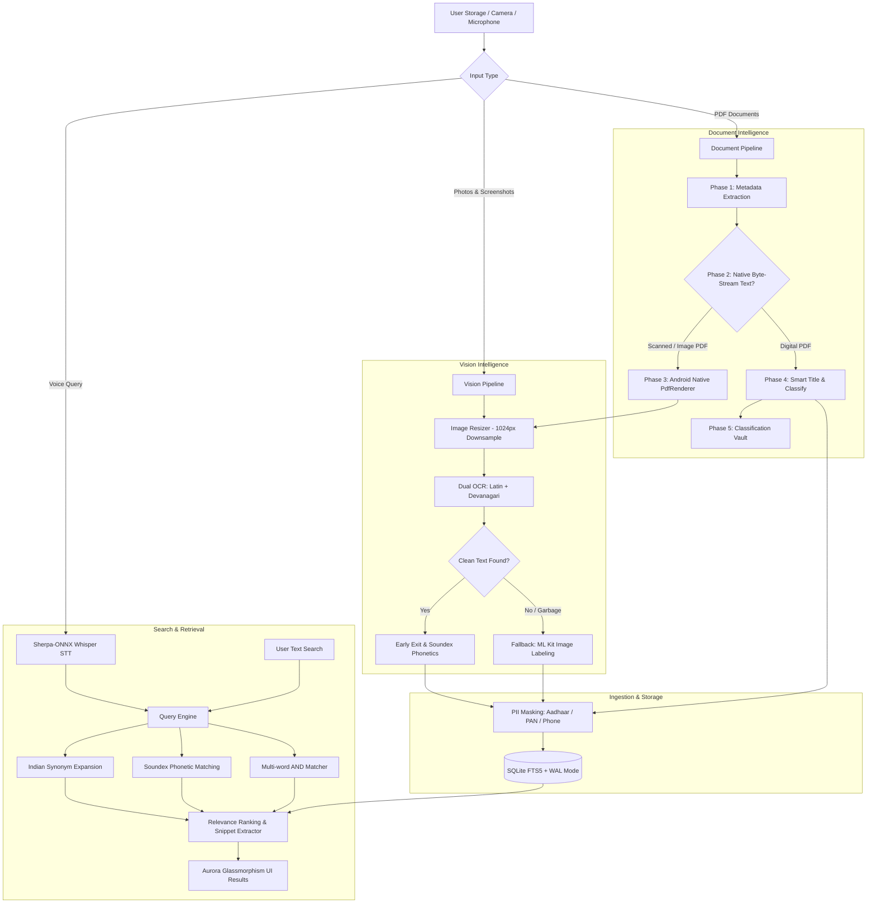

<div align="center">
  

  # PinPointer
  
  **A Privacy-First, Offline Search Engine & Intelligent Media Organizer**<br>
  <sub>Crafted with passion by <strong>Northern Blades</strong></sub>

  <p align="center">
    <a href="https://github.com/ScRocXx/Hackday-1.0/releases/download/app/Pinpointer-v1.1.apk">
      
    </a>
    <a href="https://github.com/ScRocXx/Hackday-1.0/releases/tag/app">
      
    </a>
  </p>

  
  
  
  
  
  
  
  
</div>

---

## 📱 Release APK Available

> [!TIP]
> **Experience PinPointer instantly on your Android device!**  
> We have pre-compiled and released a production-ready APK bundled with the quantized offline Whisper STT model and native rasterization engines.

- 📦 **Release Asset**: [`Pinpointer-v1.1.apk`](https://github.com/ScRocXx/Hackday-1.0/releases/download/app/Pinpointer-v1.1.apk) (~230 MB, bundled with on-device models)
- 🏷️ **Release Tag**: [`app`](https://github.com/ScRocXx/Hackday-1.0/releases/tag/app)
- 📥 **Direct Download Link**: [**Download Pinpointer-v1.1.apk**](https://github.com/ScRocXx/Hackday-1.0/releases/download/app/Pinpointer-v1.1.apk)
- 📲 **Quick Install**: Download the APK onto your Android phone, enable *"Install unknown apps"* for your browser/file manager if prompted, and launch PinPointer.

---

## 🎯 Core Vision

**PinPointer** is a **high-performance, Local-First Knowledge Graph and Offline Search Engine** natively engineered for Android using React Native, custom Kotlin/Java native modules, and embedded on-device machine learning. 

PinPointer transforms how people interact with their personal devices by unlocking the trapped text and intelligence within screenshots, photos, receipts, IDs, and multi-page PDFs—**100% offline, without telemetry, and without sending a single byte to the cloud**.

---

## 🔴 The Problem: "Dark Data" in Personal Storage

Millions of sensitive, high-value documents reside in everyday mobile storage as **"Dark Data"**:
- 📸 **Screenshots**: Transaction confirmations, Wi-Fi passwords, flight details, messages.
- 🖼️ **Photos**: Handwritten prescriptions, electricity bills, Aadhaar cards, PAN cards, warranties.
- 📄 **PDFs**: Scanned tax returns, salary slips, bank statements, marksheets, legal agreements.

### Why Typical Approaches Fail
- ☁️ **Cloud APIs (Vision/OCR)**: Severe privacy risks. Sending Aadhaar, PAN, and banking documents to third-party remote servers is unacceptable for privacy-minded users.
- 🔋 **Naive Offline AI**: Running multi-modal or heavy object recognition models indiscriminately over 10,000 photos exhausts mobile batteries within hours and overheats the device.
- 🇮🇳 **Lack of Multilingual / Indian Context**: Most search engines fail when dealing with bilingual documents containing Hindi (Devanagari), Romanized transliterations (Hinglish), or Indian document structures.
- ⏱️ **Latency & Network Dependency**: Cloud solutions require fast internet and incur recurring subscription or API token costs.

---

## ✨ The PinPointer Solution: "Internet-Zero" Architecture

1. **Zero Cloud Telemetry**: All OCR, speech recognition, classification, indexing, and search happen on-device.
2. **Sequential Early-Exit Pipeline**: Detects clean text first and immediately halts downstream heavy processing—bypassing object detection on **over 90%** of text images to preserve battery life.
3. **5-Phase PDF Intelligence**: Blends instant native byte-stream extraction for digital PDFs with high-resolution native rasterization + OCR for scanned documents.
4. **Deterministic Multilingual & Transliteration**: Devanagari script is transliterated to Hinglish and enriched with English conceptual tags deterministically—zero hallucinations, zero LLM memory overhead.
5. **PII Security by Design**: Automatic redaction of sensitive identifiers (Aadhaar, PAN, Phone numbers) directly at the database ingestion chokepoint before hitting disk.
6. **On-Device Whisper STT**: Powered by `sherpa-onnx` and quantized INT8 Whisper for hands-free voice search with zero internet requirement.

---

## 🏗️ Technical Architecture & Implemented Modules



---

### 1. 🧠 Intelligent Vision Pipeline (`src/utils/VisionPipeline.ts`)
- **Downsampling**: Dynamic downsampling to 1024×1024 JPEG (quality 80) via `react-native-image-resizer` with automated temp-file garbage collection to prevent memory leaks and disk bloat.
- **Dual Parallel OCR**: Concurrently runs Google ML Kit Latin and Devanagari text recognition engines.
- **Noise & Garbage Filtering**: Strict alphanumeric/Devanagari ratio heuristic (rejects noise if clean characters < 30% or predominantly single-char artifacts).
- **Sequential Early-Exit**: Once valid text is confirmed, object detection is completely skipped.
- **Fallback Object Detection**: If no text is found, falls back to `@react-native-ml-kit/image-labeling` (top 7 labels at ≥50% confidence).
- **Phonetic Encoding**: Indexes Soundex phonetic representations alongside raw tokens for typo tolerance.

---

### 2. 📄 5-Phase PDF Document Pipeline (`src/utils/DocumentPipeline.ts`)
- **Phase 1 — Metadata Extraction**: Extracts page counts, file names, and byte sizes via native Android bridge `NativePdfModule.kt` in ~10ms.
- **Phase 2 — Native Byte-Stream Text Parsing**: Reads PDF content streams directly (parsing `BT`...`ET` operators and `Tj`/`TJ` text strings) for instant extraction from digital PDFs (~50ms per document) without invoking OCR.
- **Phase 3 — Native Page Rasterization**: For scanned/flattened PDFs, renders foreground pages (pages 1–3) to JPEGs using Android's native `android.graphics.pdf.PdfRenderer` without third-party heavy dependencies.
- **Phase 4 — AI OCR & Enrichment**: Rasterized pages are processed through `VisionPipeline.ts` for Latin and Hindi extraction.
- **Phase 5 — Storage & Search Indexing**: Extracted tokens are indexed into SQLite with title and content mapping.

---

### 3. 🏷️ Zero-Cost Document Classifier (`src/utils/DocumentClassifier.ts`)
Classifies documents and generates **Smart Titles** in <1ms without any heavy machine learning models:
- **20 Document Categories**:
  - 🪪 **Identity**: Aadhaar Card, PAN Card, Voter ID, Driving License, Passport
  - 🏦 **Financial**: Bank Statement, Salary Slip, Tax Return / Form 16, Invoice, Receipt
  - 🎓 **Education & Career**: Marksheet, Degree / Certificate, Resume
  - 💡 **Bills & Utilities**: Electricity Bill, Phone / Broadband Bill, Insurance Policy
  - 🏥 **Healthcare & Legal**: Medical Prescription / Report, Property Deed / Lease, General Documents
- **Smart Title Extraction**: Detects document context to rename arbitrary files (e.g., `IMG_20240215_WA0012.pdf` becomes *"SBI Account Statement"* or *"Torrent Power Electricity Bill"*).

---

### 4. ⚡ High-Performance Hybrid Search Engine (`src/Database.ts`)
- **SQLite with WAL Mode**: Configured with Write-Ahead Logging for non-blocking concurrent reads and sync writes.
- **FTS5 Virtual Table**: Full-Text Search with `unicode61` tokenizer and automated database triggers (`AFTER INSERT`, `AFTER DELETE`, `AFTER UPDATE`).
- **Indian Synonym Expansion**: Automatically expands common bilingual aliases:
  - `aadhaar` ↔ `aadhar`, `uidai`
  - `pan` ↔ `pancard`, `permanent account number`
  - `license` ↔ `licence`, `driving licence`, `dl`
  - `electricity` ↔ `electric bill`, `bijli`, `power bill`
  - `salary` ↔ `payslip`, `pay slip`, `ctc`
- **Typo-Tolerant Soundex**: Phonetic encoding for tolerant matching on names and transcribed speech.
- **Relevance Scoring**: Weighted ranking combining title matches (+50 pts), exact phrase matches (+30 pts), keyword matches (+10 pts), and recency decay boost.
- **Snippet Extractor with Highlighting**: Extracts a focused ~80-character snippet surrounding the matched keyword with amber highlighting.

---

### 5. 🇮🇳 Deterministic Multilingual & Transliteration (`src/utils/HindiTranslit.ts` & `src/utils/TextEnrichment.ts`)
- **Rule-Based Devanagari-to-Hinglish Transliteration**: Maps vowels, matras, consonants, conjuncts (क्ष, त्र, ज्ञ), and nukta variants into Romanized Hindi (e.g., `"आधार"` → `"aadhaar"`, `"कमल"` → `"kamal"`).
- **Concept Tagging**: Injects English semantic equivalents (e.g., `"बिजली"` → `"electricity"`, `"वेतन"` → `"salary"`).
- **Zero Latency**: Pure algorithmic string mapping in JavaScript (<0.5ms)—completely eliminates LLM hallucinations, token usage, and RAM pressure.

---

### 6. 🎙️ On-Device Voice Intelligence (`src/android/.../SherpaOnnxModule.kt`)
- **Sherpa-ONNX Bridge**: Integrates the `sherpa-onnx` native AAR (by k2-fsa) directly using JNI bindings.
- **Offline Quantized Whisper Base**: Runs an INT8-quantized Whisper model locally on CPU/NPU.
- **PCM 16kHz Streaming**: Native audio recorder captures 16-bit mono PCM audio and feeds it directly into the offline recognizer.
- **Interactive Listening UI**: Features Google-style pulsating four-color voice animated indicators and real-time audio visualization.

---

### 7. 🛡️ PII Masking & Data Privacy (`src/utils/DataMasking.ts`)
Before any content is inserted into the SQLite database, it passes through an immutable redaction layer:
- **Aadhaar Numbers**: `1234 5678 9012` → `****-****-9012`
- **PAN Numbers**: `ABCDE1234F` → `ABCDE****F`
- **Phone Numbers**: `9876543210` → `******3210`

---

## 🎨 User Interface & Application Screens

| Screen | File | Highlights |
|---|---|---|
| **Pinpointer Home** | [`PinpointerScreen.tsx`](file:///c:/Users/pc/Downloads/Hackday%201.0/src/screens/PinpointerScreen.tsx) | Aurora dark-mode glassmorphism interface, integrated search pill, animated voice orb, live sync progress card, category filter chips (`All`, `Photos`, `Documents`), full-screen preview with zoom, quick scan, share, and edit. |
| **Drawer Dashboard** | [`HomeScreen.tsx`](file:///c:/Users/pc/Downloads/Hackday%201.0/src/screens/HomeScreen.tsx) | Quick access drawer featuring "Scan Images", "Doc Vault", "Recent Searches", and "Universal Sync" button. |
| **Document Vault** | [`DocumentVaultScreen.tsx`](file:///c:/Users/pc/Downloads/Hackday%201.0/src/screens/DocumentVaultScreen.tsx) | Auto-categorized document repository with badge colors, document counts, confidence indicators, and native PDF viewer launching. |
| **Scan Images / Smart Clipboard** | [`SmartClipboardScreen.tsx`](file:///c:/Users/pc/Downloads/Hackday%201.0/src/screens/SmartClipboardScreen.tsx) | Real-time camera capture & gallery OCR scanning, instant copy-to-clipboard, text editor, share sheet, and scan history. |
| **Point & Speak** | [`PointAndSpeakScreen.tsx`](file:///c:/Users/pc/Downloads/Hackday%201.0/src/screens/PointAndSpeakScreen.tsx) | Point-and-shoot camera OCR with animated radar wave scanning and text extraction. |
| **Speech to Text** | [`SpeechToTextScreen.tsx`](file:///c:/Users/pc/Downloads/Hackday%201.0/src/screens/SpeechToTextScreen.tsx) | Dedicated offline speech recognition console featuring dynamic audio visualizer waveforms and transcription history. |
| **Recent Searches & Gallery** | [`gallery.tsx`](file:///c:/Users/pc/Downloads/Hackday%201.0/src/screens/gallery.tsx) | Chronologically filtered media browser (*Today*, *Yesterday*, *Last Week*) with quick share and full-res image modal. |

---

## 📊 Performance Benchmarks

| Task / Operation | Engine / Method | Benchmark Time |
|---|---|---|
| **Digital PDF Text Extraction** | Custom Native Byte-Stream Parser | **~30–50 ms** / page |
| **Scanned PDF Rasterization** | Android `PdfRenderer` Native Bridge | **~150–200 ms** / page |
| **Downsampled Image OCR (1024px)** | Google ML Kit (Latin + Devanagari) | **~120–180 ms** |
| **Object Detection (Fallback only)** | Google ML Kit Image Labeling | **~250 ms** *(Bypassed on 90%+)* |
| **FTS5 Full-Text Query (50,000+ records)** | SQLite FTS5 with Unicode61 Tokenizer | **< 15 ms** |
| **Document Classification & Smart Title** | Deterministic Keyword Rule Engine | **< 1 ms** |
| **Devanagari Transliteration** | Pure JS Character Map | **< 0.5 ms** |
| **PII Data Scrubbing** | Regex Chokepoint (`DataMasking.ts`) | **< 0.1 ms** |
| **Offline Voice Recognition** | Sherpa-ONNX Whisper Base (INT8) | **Near Real-time** |

---

## 🛠️ Project Structure

```text
Hackday-1.0/
├── android/                                 # Native Android platform
│   ├── app/
│   │   ├── libs/                            # sherpa-onnx native AAR
│   │   └── src/main/
│   │       ├── assets/models/whisper/       # Bundled Whisper INT8 STT model files
│   │       └── java/ai/runanywhere/starter/
│   │           ├── MainActivity.kt          # Main React Native activity
│   │           ├── MainApplication.kt       # Native package registrations
│   │           ├── NativeAudioModule.kt     # Native PCM audio capture module
│   │           ├── NativePdfModule.kt       # Native PdfRenderer rasterizer & info
│   │           ├── OCRModule.java           # Google ML Kit Devanagari OCR bridge
│   │           ├── SherpaOnnxModule.kt      # Offline Whisper STT via sherpa-onnx
│   │           └── StorageModule.java       # Asset unpacker & Intent-based PDF opener
├── src/
│   ├── assets/                              # App icons and graphics
│   ├── components/                          # Reusable UI components
│   │   ├── AudioVisualizer.tsx              # Audio level waveform bars
│   │   ├── FeatureCard.tsx                  # Dashboard action cards
│   │   ├── ModelDownloadSheet.tsx           # Offline model management modal
│   │   ├── ModelLoaderWidget.tsx            # Model initialization indicator
│   │   ├── SearchFilterChips.tsx            # All / Photos / Documents filter pills
│   │   ├── SearchHistoryPanel.tsx           # Recent search query suggestions
│   │   └── SyncProgressCard.tsx             # Live syncing progress card
│   ├── hooks/                               # Custom React hooks & context
│   │   ├── PinpointerContext.tsx            # Shared search, sync & state provider
│   │   ├── useDocumentSync.ts               # Background PDF indexing hook
│   │   ├── useGallerySync.ts                # CameraRoll image indexing hook
│   │   ├── useSearch.ts                     # Debounced search & query execution
│   │   └── useVoiceRecording.ts             # Sherpa-ONNX microphone listener
│   ├── navigation/                          # React Navigation stack & route types
│   ├── screens/                             # Application views
│   │   ├── DocumentVaultScreen.tsx          # Classified document organizer
│   │   ├── gallery.tsx                      # Recent photos & media viewer
│   │   ├── HomeScreen.tsx                   # Drawer menu & sync trigger dashboard
│   │   ├── PinpointerScreen.tsx             # Primary search interface & results
│   │   ├── PointAndSpeakScreen.tsx          # Point-and-shoot camera OCR
│   │   ├── SmartClipboardScreen.tsx         # Image to text scanner & clipboard
│   │   └── SpeechToTextScreen.tsx           # Dedicated offline STT playground
│   ├── services/                            # Background model services
│   ├── theme/                               # Colors, dark theme & styles
│   ├── utils/                               # Core pipelines & algorithms
│   │   ├── AppLogger.ts                     # Structured logging utility
│   │   ├── DataMasking.ts                   # PII redaction (Aadhaar/PAN/Phone)
│   │   ├── DocumentClassifier.ts            # 20-category zero-cost classifier
│   │   ├── DocumentPipeline.ts              # 5-phase PDF intelligence engine
│   │   ├── GallerySync.ts                   # Storage scanner & thumbnail engine
│   │   ├── HindiTranslit.ts                 # Devanagari to Hinglish transliteration
│   │   ├── RecentPhotos.ts                  # Local recent search history
│   │   ├── Soundex.ts                       # Phonetic typo tolerance algorithm
│   │   ├── TextEnrichment.ts                # Multilingual search index builder
│   │   └── VisionPipeline.ts                # Downsample + OCR + Labeling pipeline
│   ├── App.tsx                              # App entry point & navigation setup
│   └── Database.ts                          # SQLite + FTS5 search engine
├── download-models.js                       # Postinstall script to fetch models & AAR
├── package.json                             # Dependencies and scripts
└── tsconfig.json                            # TypeScript configuration
```

---

## 💻 Tech Stack & Key Libraries

| Layer | Component | Technologies Used |
|---|---|---|
| **Core Framework** | Frontend App | React Native `0.83.1`, React `19.2.0`, TypeScript `5.9.2` |
| **Database & Search** | Local Storage | `react-native-quick-sqlite` (SQLite 3 with FTS5, WAL Mode) |
| **Computer Vision** | OCR & Detection | `@react-native-ml-kit/text-recognition`, `@react-native-ml-kit/image-labeling` |
| **Voice / STT** | On-Device Speech | `sherpa-onnx` 1.13.6 AAR (Whisper Base INT8 Quantized) |
| **Native Android** | Platform Bridges | Kotlin & Java (`PdfRenderer`, `AudioRecord`, `StorageModule`, `FileProvider`) |
| **Image Processing** | Resizing & Prep | `react-native-image-resizer`, `@react-native-camera-roll/camera-roll` |
| **Navigation & UI** | Interface & Styling | `@react-navigation/stack`, `react-native-linear-gradient`, `react-native-svg` |

---

## 🚀 Getting Started & Local Development

### Prerequisites
- **Node.js**: `v18.x` or later
- **JDK**: Java 17 or Java 11
- **Android SDK**: Android 10+ (API level 29+ recommended, compiles on SDK 35)
- **Physical Device or Android Emulator** with camera and microphone permissions enabled

### Installation

1. **Clone the repository**:
   ```bash
   git clone https://github.com/ScRocXx/Hackday-1.0.git
   cd Hackday-1.0
   ```

2. **Install dependencies**:
   ```bash
   npm install
   ```
   > *Note: The `postinstall` script automatically applies patches and runs `download-models.js` to fetch the Sherpa-ONNX native AAR and quantized Whisper model files into `android/app/libs` and `android/app/src/main/assets/models`.*

3. **Start the Metro bundler**:
   ```bash
   npm start
   ```

4. **Launch on Android**:
   ```bash
   npx react-native run-android
   ```

---

## 🔒 Privacy Guarantees

- **No Remote Servers**: Zero external API calls, zero analytics, zero data logging.
- **On-Device Storage**: The SQLite index (`pinpoint.db`) is stored exclusively in the app's internal sandbox.
- **PII Protection**: Sensitive identifiers are masked at the database insertion boundary; plain-text numbers for Aadhaar or PAN are never persisted.
- **Airplane-Mode Operational**: Fully functional with Wi-Fi and mobile data completely disabled.

---

## 👥 Authors & Acknowledgments

- **Team Northern Blades** — Creators and maintainers of PinPointer.
- **sherpa-onnx (k2-fsa)** — High-performance embedded speech recognition runtime.
- **Google ML Kit** — Lightweight on-device vision APIs.

---

<div align="center">
  <sub>Built with ❤️ for privacy, efficiency, and seamless offline search.</sub>
</div>
